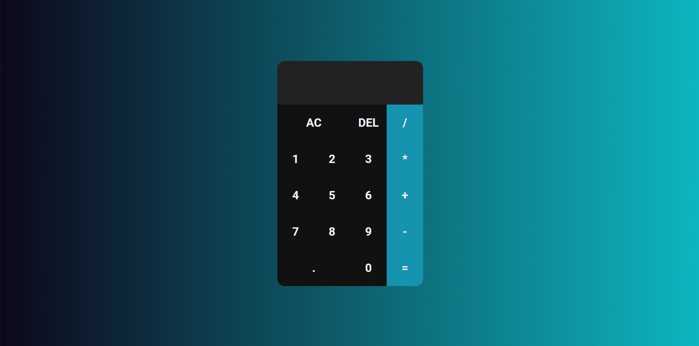

<h1 align="center">Calculadora-com-JS</h1>

<a href="#sobre">sobre</a> .
<a href="#tecnologia">tecnologia</a> .
<a href="#estilos">estilos</a>

# sobre

Uma calculadora simples com funcionalidades de soma, subtração, multiplicaçao e divisão feita inteiramente com javaScript,

 abordando algumas das funcionalidades mais usadas do JS. não foi utilizado nenhum plugin e nem biblioteca nesse projeto.

---

# tecnologia

<h3>HTML<h3>
<h3>CSS<h3>
<h3>JAVASCRIPT<h3>

---

# estilos

<h1 align="center">
    
</h1>
